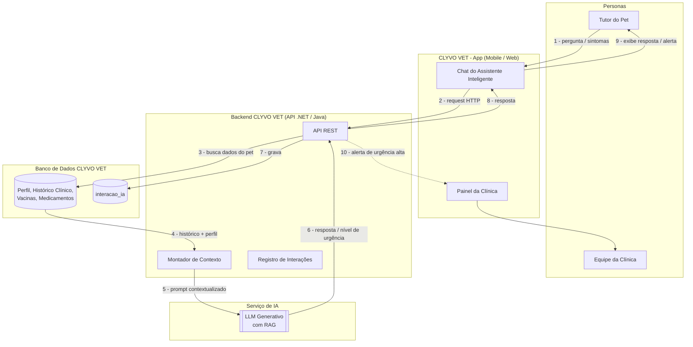

# Arquitetura de Integração — Assistente Inteligente CLYVO

Diagrama mostrando a comunicação entre tutor, aplicação, banco de dados, backend e o componente de IA.

## Legenda do fluxo

| Nº | Etapa |
|---|---|
| 1 | Tutor envia pergunta ou descreve sintomas no chat do app |
| 2 | App chama a API do backend |
| 3-4 | Backend consulta o banco de dados relacional para obter perfil, histórico clínico, vacinas e medicamentos do pet |
| 5 | Backend monta o prompt com o contexto do pet + pergunta do tutor e envia ao serviço de IA |
| 6 | LLM retorna resposta em linguagem natural (ou classificação de urgência, no caso de triagem) |
| 7 | Interação é registrada para auditoria e melhoria contínua |
| 8-9 | Resposta é devolvida e exibida ao tutor no app |
| 10 | Em caso de urgência alta, um alerta é encaminhado ao painel da clínica |
